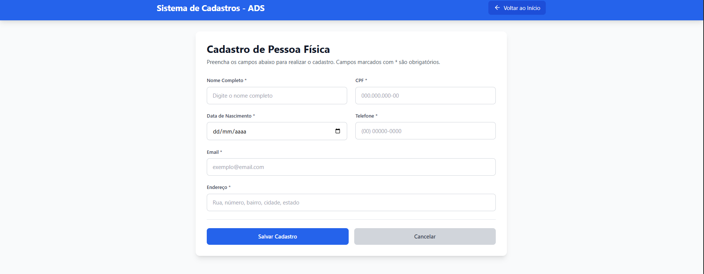
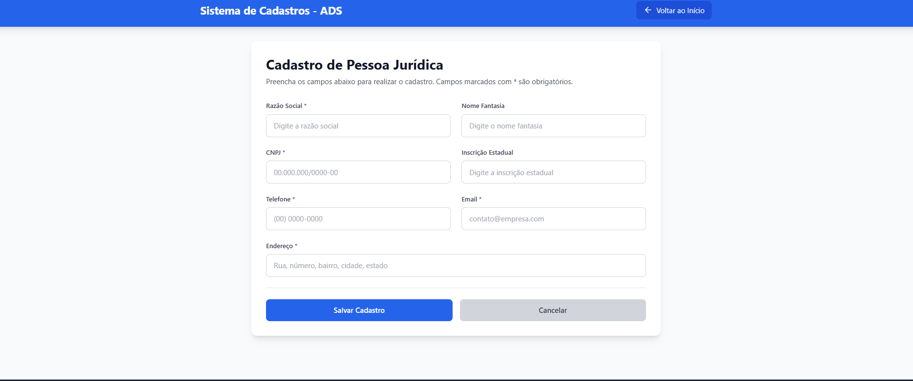
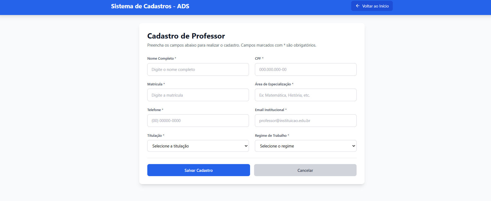
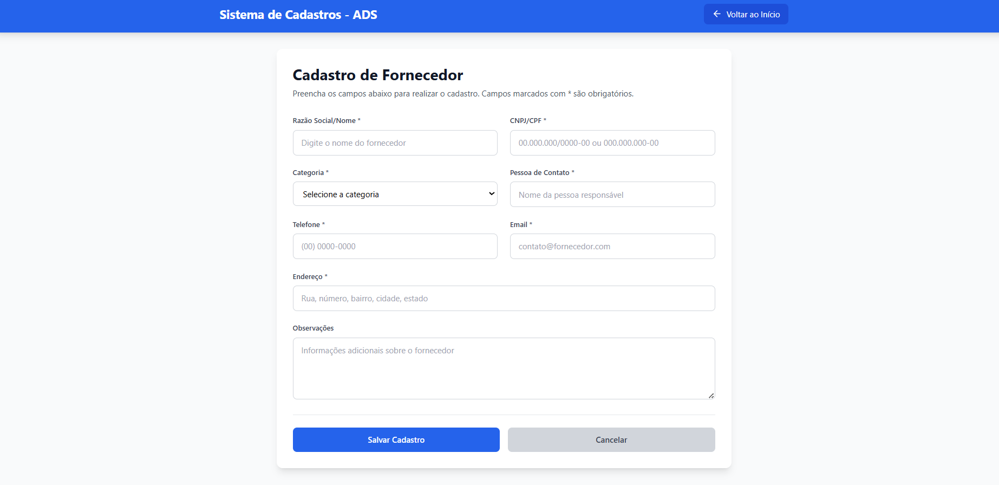
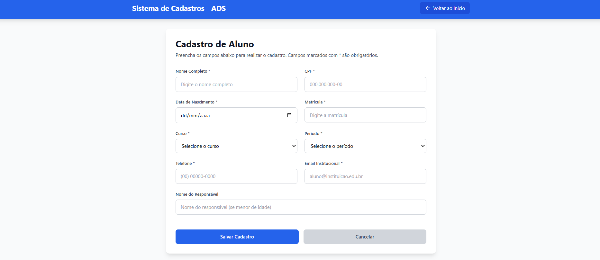

# Sistema de Cadastros - Projeto Integrador ADS

## 📋 Integrantes do Grupo
- [Nome do Integrante 1] - RA: [000000]  
- [Nome do Integrante 2] - RA: [000000]  
- [Nome do Integrante 3] - RA: [000000]  
- [Nome do Integrante 4] - RA: [000000]  

## 📚 Introdução

Este projeto representa a **segunda etapa** do Projeto Integrador do curso de Análise e Desenvolvimento de Sistemas. O objetivo principal é desenvolver protótipos funcionais das telas de interface do sistema, criando formulários navegáveis para cada jornada de cadastro especificada na primeira etapa.


### 🎯 Objetivo do Sistema

O sistema visa centralizar e padronizar o processo de cadastro de diferentes entidades em uma instituição de ensino, proporcionando:

- **Gestão Unificada**: Centralização dos cadastros em uma única plataforma
- **Interface Intuitiva**: Experiência de usuário clara e objetiva
- **Validação de Dados**: Garantia da integridade das informações cadastradas
- **Feedback Visual**: Mensagens claras de sucesso e erro para o usuário

### 🏗️ Funcionalidades Implementadas

O sistema contempla as seguintes jornadas de cadastro:

1. **Pessoa Física** - Cadastro de indivíduos com dados pessoais
2. **Pessoa Jurídica** - Cadastro de empresas e organizações
3. **Professores** - Cadastro de docentes e educadores
4. **Fornecedores** - Cadastro de parceiros e prestadores de serviço
5. **Alunos** - Cadastro de estudantes e discentes

## 🚀 Como Visualizar os Protótipos

### Pré-requisitos
- Navegador web moderno (Chrome, Firefox, Safari, Edge)
- Node.js 16+ (opcional, apenas para desenvolvimento)

### Instruções de Visualização

1. **Acesso Local**: 
   ```bash
   # Clone ou baixe o projeto
   # Navegue até a pasta do projeto
   npm install    # Instalar dependências
   npm run dev    # Iniciar servidor de desenvolvimento
   ```

2. **Navegação no Sistema**:
   - Acesse a página inicial do sistema
   - Clique em qualquer um dos 5 cards de cadastro disponíveis
   - Preencha os formulários e teste as funcionalidades
   - Use o botão "Voltar ao Início" para navegar entre as telas

3. **Funcionalidades Testáveis**:
   - ✅ Preenchimento de formulários
   - ✅ Validação básica de campos
   - ✅ Mensagens de feedback (sucesso/erro)
   - ✅ Navegação entre telas
   - ✅ Interface responsiva

## 📋 Diagramas da Primeira Etapa

### Diagrama de Casos de Uso

*Diagrama apresentando os principais casos de uso do sistema*

### Diagrama de Classes

*Diagrama mostrando a estrutura das classes e seus relacionamentos*

## 🔗 Links dos Protótipos

### Formulários de Cadastro
- 👤 **[Pessoa Física](./src/components/PessoaFisica.tsx)** - Campos: Nome, CPF, Data Nascimento, Endereço, Telefone, Email
- 🏢 **[Pessoa Jurídica](./src/components/PessoaJuridica.tsx)** - Campos: Razão Social, CNPJ, Inscrição Estadual, Contato
- 🎓 **[Professor](./src/components/Professor.tsx)** - Campos: Dados Pessoais, Matrícula, Especialização, Titulação
- 🚚 **[Fornecedor](./src/components/Fornecedor.tsx)** - Campos: Razão Social, Categoria, Pessoa de Contato, Documentos
- 📚 **[Aluno](./src/components/Aluno.tsx)** - Campos: Dados Pessoais, Matrícula, Curso, Período, Responsável

## 📁 Estrutura do Projeto

```
projeto-integrador-ads/
├── src/
│   ├── App.tsx                 # Componente principal e navegação
│   ├── components/             # Componentes dos formulários
│   │   ├── PessoaFisica.tsx   # Formulário Pessoa Física
│   │   ├── PessoaJuridica.tsx # Formulário Pessoa Jurídica
│   │   ├── Professor.tsx      # Formulário Professor
│   │   ├── Fornecedor.tsx     # Formulário Fornecedor
│   │   └── Aluno.tsx          # Formulário Aluno
│   └── index.css              # Estilos globais
├── documentacao/               # Documentos e diagramas
│   ├── diagrama-casos-uso.png # Diagrama de Casos de Uso
│   └── diagrama-classes.png   # Diagrama de Classes
├── README.md                   # Este arquivo
└── package.json               # Dependências do projeto
```

## 🛠️ Tecnologias Utilizadas

- **Frontend**: React 18 + TypeScript
- **Estilização**: Tailwind CSS
- **Ícones**: Lucide React
- **Build**: Vite
- **Linguagem**: TypeScript/JavaScript

## 📋 Campos dos Formulários

### 👤 Pessoa Física
- Nome Completo* | CPF* | Data de Nascimento*
- Telefone* | Email* | Endereço*


### 🏢 Pessoa Jurídica  
- Razão Social* | Nome Fantasia | CNPJ*
- Inscrição Estadual | Telefone* | Email* | Endereço*


### 🎓 Professor
- Nome Completo* | CPF* | Matrícula*
- Área de Especialização* | Telefone* | Email Institucional*
- Titulação* | Regime de Trabalho*


### 🚚 Fornecedor
- Razão Social/Nome* | CNPJ/CPF* | Categoria*
- Pessoa de Contato* | Telefone* | Email*
- Endereço* | Observações


### 📚 Aluno
- Nome Completo* | CPF* | Data de Nascimento*
- Matrícula* | Curso* | Período*
- Telefone* | Email Institucional* | Nome do Responsável


*\* Campos obrigatórios*

## 📝 Observações Técnicas

- **Responsividade**: Interface adaptável para desktop, tablet e mobile
- **Validação**: Validação básica de campos obrigatórios
- **Feedback**: Sistema de mensagens de sucesso e erro
- **Navegação**: Sistema de navegação intuitivo entre telas
- **Acessibilidade**: Labels adequados e foco nos elementos

## 👥 Equipe de Desenvolvimento

Este projeto foi desenvolvido como parte do Projeto Integrador do curso de **Análise e Desenvolvimento de Sistemas**, representando a evolução dos diagramas conceituais (primeira etapa) para protótipos funcionais navegáveis (segunda etapa).

---

**Projeto Integrador - ADS 2024**  
*Protótipos Funcionais - 2ª Etapa*