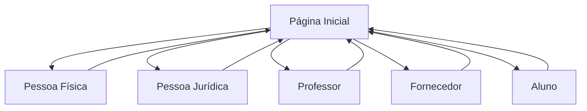

# Estrutura do Projeto - Sistema de Cadastros

## 📂 Organização de Arquivos

### Estrutura Geral
```
projeto-integrador-ads/
├── 📁 src/                     # Código fonte do projeto
│   ├── 📄 App.tsx             # Componente principal
│   ├── 📄 main.tsx            # Ponto de entrada da aplicação
│   ├── 📄 index.css           # Estilos globais
│   └── 📄 vite-env.d.ts       # Tipos do Vite
├── 📁 documentacao/           # Documentação do projeto
│   ├── 📄 README.md           # Documentação principal
│   ├── 📄 estrutura-projeto.md # Este arquivo
│   ├── 🖼️ diagrama-casos-uso.png
│   └── 🖼️ diagrama-classes.png
├── 📁 public/                 # Arquivos públicos
├── 📄 package.json            # Dependências e scripts
├── 📄 tsconfig.json           # Configuração TypeScript
├── 📄 tailwind.config.js      # Configuração Tailwind
└── 📄 vite.config.ts          # Configuração Vite
```

## 🧩 Componentes do Sistema

### Componente Principal (App.tsx)
- **Responsabilidade**: Gerenciar navegação e estado global
- **Funcionalidades**:
  - Controle de telas (home/formulários)
  - Sistema de feedback (sucesso/erro)
  - Navegação entre componentes

### Formulários Implementados
Cada formulário está integrado no componente principal:

1. **PessoaFisicaForm** - Dados pessoais básicos
2. **PessoaJuridicaForm** - Dados empresariais
3. **ProfessorForm** - Dados acadêmicos
4. **FornecedorForm** - Dados comerciais  
5. **AlunoForm** - Dados estudantis

## 🎨 Sistema de Design

### Paleta de Cores
- **Primária**: Azul (#2563EB) - Navegação e ações principais
- **Sucesso**: Verde (#059669) - Feedbacks positivos
- **Erro**: Vermelho (#DC2626) - Feedbacks de erro
- **Neutro**: Cinza - Textos e backgrounds

### Componentes Reutilizáveis
- **FormField**: Campo de formulário padronizado
- **Feedback**: Sistema de mensagens
- **Navigation**: Controles de navegação

## 📋 Padrões de Desenvolvimento

### Convenções de Código
- **Nomenclatura**: camelCase para variáveis, PascalCase para componentes
- **Organização**: Um componente por funcionalidade
- **Tipagem**: TypeScript para todas as funções e estados

### Estrutura de Estado
```typescript
// Estado principal da aplicação
type Screen = 'home' | 'pessoa-fisica' | 'pessoa-juridica' | 'professor' | 'fornecedor' | 'aluno';
type FeedbackType = 'success' | 'error' | null;

interface Feedback {
  type: FeedbackType;
  message: string;
}
```

## 🔄 Fluxo de Navegação



## 🧪 Funcionalidades Testáveis

### Validações Implementadas
- ✅ Campos obrigatórios marcados com *
- ✅ Validação de preenchimento básico
- ✅ Feedback visual de sucesso/erro
- ✅ Reset de formulário ao cancelar

### Casos de Teste
1. **Preenchimento completo** - Todos os campos obrigatórios
2. **Cancelamento** - Teste de limpeza de dados
3. **Feedback visual** - Mensagens de sucesso/erro
4. **Navegação** - Transição entre telas

## 📱 Responsividade

### Breakpoints
- **Mobile**: < 768px - Layout em coluna única
- **Tablet**: 768px - 1024px - Layout adaptado
- **Desktop**: > 1024px - Layout completo em grid

### Adaptações por Dispositivo
- **Cards na home**: 1 coluna (mobile) → 2 colunas (tablet) → 3 colunas (desktop)
- **Formulários**: 1 coluna (mobile) → 2 colunas (desktop)
- **Navegação**: Botões adaptativos

## 🔧 Configurações Técnicas

### Dependências Principais
```json
{
  "react": "^18.3.1",
  "react-dom": "^18.3.1",
  "lucide-react": "^0.344.0",
  "tailwindcss": "^3.4.1"
}
```

### Scripts Disponíveis
```json
{
  "dev": "vite",              // Desenvolvimento
  "build": "vite build",      // Build para produção
  "preview": "vite preview",  // Preview do build
  "lint": "eslint ."          // Verificação de código
}
```

---

**Documentação técnica do Projeto Integrador ADS**  
*Atualizada em: Janeiro 2024*